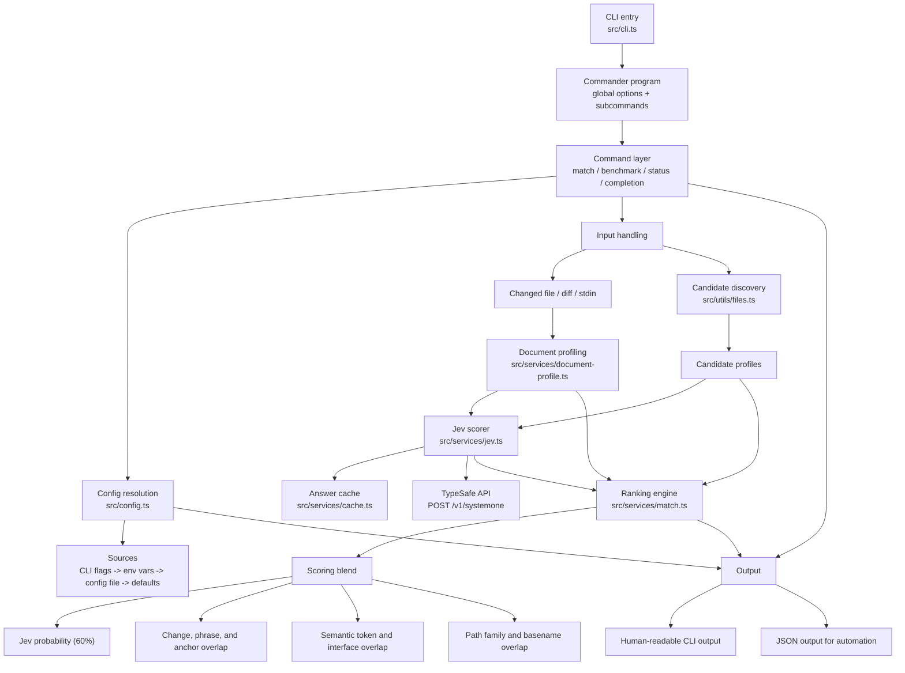

# semantic-test-matcher

`semantic-test-matcher` is a TypeScript CLI for semantic test matching. It exposes the `rbt` command, which ranks likely test files for a changed source file, inspects resolved runtime configuration, and prints shell completion scripts.

> **OpenJEV support:** Jev is built by [TypeSafe](https://typesafe.ai). This fork keeps TypeSafe as the default and adds optional support for [OpenJEV](https://openjev.sh), a free community gateway to the same Jev model — set `OPENJEV_API_KEY` (or `JEV_PROVIDER=openjev`) to use it. Original project: https://github.com/JustasMonkev/semantic-test-matcher by @JustasMonkev.

The matching flow combines:

- document profiling from file paths, code structure, and diffs
- TypeSafe's [Jev](https://docs.typesafe.ai/) System One model, which judges whether each candidate test file should re-run for the change
- a local answer cache
- score blending for Jev and structural signals

## Features

- `rbt match <file>` ranks candidate tests for a changed file
- `rbt benchmark` scores the matcher against a file of expected rankings
- `rbt status` shows the resolved runtime configuration
- `rbt completion [bash|zsh]` prints a shell completion script
- scores all candidates for a change in one Jev request, typically 150–500 ms
- falls back to local structural heuristics when no API key is available
- caches Jev answers in `.rbt/cache` by default
- accepts candidate file lists from CLI flags, config, or stdin

## Architecture



## Requirements

- Node.js 22.12 or newer
- a TypeSafe API key from [console.typesafe.ai/keys](https://console.typesafe.ai/keys) in `TYPESAFE_API_KEY` (without one, `rbt` ranks with local heuristics only)
- **or** an OpenJEV API key from [openjev.sh/dashboard](https://openjev.sh/dashboard) in `OPENJEV_API_KEY` — OpenJEV is a free community gateway to the same Jev model. If only `OPENJEV_API_KEY` is set, it is used automatically; if both keys are set, TypeSafe is the default unless `JEV_PROVIDER=openjev` is set.

## Install

```bash
npm install --global semantic-test-matcher
export TYPESAFE_API_KEY=...
# or, using OpenJEV instead:
# export OPENJEV_API_KEY=...
```

Verify the installation:

```bash
rbt --version
rbt status
```

## Quick Start

Match a changed file to likely tests, passing the change as a diff:

```bash
git diff > change.diff
rbt match src/price-engine.ts --candidates tests --diff-file change.diff --json
```

Inspect resolved settings:

```bash
rbt status --json
```

Print shell completion:

```bash
rbt completion zsh
```

## Commands

### `match`

Ranks likely candidate files for one or more changed source files and merges the selections; a test picked for several files keeps its best score.

With no file arguments or `--diff-file`, `rbt match` detects local Git changes under the current directory (staged, unstaged, deleted, and non-ignored untracked JS/TS files). It shows the selected tests, then asks which test command to run, pre-filled from your `test` script when that script runs Vitest, Jest, Playwright, or Mocha with options and their values only (a script that already names test paths, such as `jest tests` or `mocha --spec ...`, would run them too, so the plain runner is suggested instead). Enter a command such as `npx playwright test`, `npx vitest run`, or `node --test`; press Enter to skip. Selected absolute paths are appended as separate arguments, and RBT returns the runner's exit code. The command accepts quoted arguments, but does not interpret shell operators, variable expansion, or pipelines. Use an executable or wrapper script that accepts test paths as trailing arguments.

This is a one-shot flow, not a watcher. A clean tree or empty selection runs nothing. A changed file that resolves outside the repository, such as an untracked symlink, is skipped with a warning. Because it runs what it selects, this mode only considers test-like candidates: `.test`/`.spec` and Deno `_test` files, and any other file outside fixture directories that declares tests (with `test(...)`, `it(...)`, `describe(...)`, or `Deno.test(...)`). Helpers and fixtures under test directories are not run. `--json` and `--paths-only` only report selections and never prompt or execute tests; use these modes without an interactive terminal. Explicit files and `--diff-file` retain their selection-only behavior. Committed branch changes still require a supplied diff.

Examples:

```bash
# Detect local changes, select tests, and ask which test command to run
rbt match --candidates tests

rbt match prompts-idea/src/price-engine.ts --candidates prompts-idea/tests

git diff main > pr.diff
rbt match --diff-file pr.diff --candidates tests

# One path per line; xargs -0 keeps spaces in paths and runs nothing for an empty selection
rbt match --diff-file pr.diff --paths-only | tr '\n' '\0' | xargs -0 -r npx playwright test

cat prompts-idea/candidate-list.txt | \
  rbt match prompts-idea/src/price-engine.ts \
    --candidates-from-stdin \
    --top-k 4 \
    --threshold 0.35 \
    --json
```

Useful flags:

- `--threshold <number>`
- `--min-score <number>`
- `--top-k <number>` (optional cap on selected files)
- `--selection-policy <adaptive|conservative|targeted>`
- `--candidates <path>` (repeat for several, e.g. `--candidates tests --candidates e2e`)
- `--include-file <glob>` (repeatable)
- `--exclude-file <glob>` (repeatable)
- `--candidates-from-stdin`
- `--ranker <jev|heuristics>`
- `--jev-model <id>`
- `--jev-provider <typesafe|openjev|auto>`
- `--cache-dir <path>`
- `--diff-file <path>`
- `--diff-root <path>` (set the base for relative diff paths, such as `.` for `git diff --relative`)
- `--json`
- `--paths-only` (print only the selected test paths, one per line)

A deleted file can still be matched: pass a `--diff-file` that contains its deletion. Every path a `--diff-file` changes must stay inside its diff root (`--diff-root`, else the Git root); a diff that names a file outside it is rejected. Candidate files larger than 1 MB are skipped with a warning. In text output, a `Why:` line explains fallback selections, such as widening coverage when neither Jev nor the structural score is confident.

How matching works:

1. The changed file (and its hunks from `--diff-file`) is read and converted into a `DocumentProfile`.
2. Candidate files are collected from configured paths or stdin.
3. Jev asks one yes/no question per candidate, "should the tests in this file be re-run to check this change?", and returns a probability. All candidates go in one request; larger suites are batched.
4. `rankMatches` blends the Jev probability (60%) with structural overlap (40%). With `--ranker heuristics`, or when Jev is unavailable, the structural score is used alone.
5. Results are filtered by the configured minimum score. The default `adaptive` policy selects every Jev-affirmative candidate (probability at least 0.5) plus structurally strong neighbors: candidates in the top structural decile with structural score at least 0.2. When no Jev score reaches 0.7, it widens the structural band to the top quartile; if structural evidence is also weak, it retains all candidates. Without Jev, the wider structural rule applies. These are selection heuristics, not inferred test dependencies or calibrated probabilities. A shared-code change can therefore select more files than a localized change.

There is no default count cap for `adaptive`. `--top-k` (or its config/environment equivalent) limits output after eligibility is computed and may exclude useful tests; JSON reports `eligibleCount`, `selectionLimit`, `selectionTruncated`, and `selectionEvidence`. Explicit `conservative` retains the blended top five by default. Explicit `targeted` retains up to five Jev-affirmative candidates by default and falls back to conservative selection when Jev is unavailable or has no affirmative answers. Both legacy policies also honor an explicit `--top-k`. The fixed bands above are uncalibrated.

### How Jev is used

- **Data leaves your machine.** Each request sends the changed file's path, exported symbol names, and its diff hunks (or, without `--diff-file`, the first 6,000 characters of the file; with `--diff-file`, source text is never sent, even for a file the diff has no text hunks for), plus each candidate test file's path and test titles, to `api.typesafe.ai` (or `api.openjev.sh` when using OpenJEV). Candidate file bodies are not sent. Review TypeSafe's [data handling](https://docs.typesafe.ai/legal) before using it on private code. Use `--ranker heuristics` to keep everything local.
- **Pass a diff.** Jev is most useful with `--diff-file`, because it can then judge the actual change rather than the whole file.
- **Fallback.** If the resolved API key is missing or the API fails after retries, `match` prints a warning to stderr and ranks with heuristics only. JSON output reports the effective `ranker` and a `rankerFallback` reason, so CI can detect the downgrade. When Jev answers, JSON also lists every model version whose answers were used in `jev.models`. `benchmark` fails instead of falling back.
- **Caching and model pinning.** Answers are cached per change and candidate in `<cacheDir>/jev.json`, so repeat runs make no requests. The default model is pinned to `jev-1.13.0` (TypeSafe) or `openjev` (OpenJEV). `jev-latest` also works with TypeSafe, but its answers can change when TypeSafe ships a new version, so they are never cached: only answers from the exact model requested are reused.
- **Cost.** Jev bills input tokens only, at $0.042 per million. A change with ~30 candidates is roughly 2,000–7,000 tokens.

### `benchmark`

Runs the matcher over a JSON file of cases (`source`, optional `diffText`, and `expectedTop1`, `expectedTop3`, or `expectedTop10Includes`) and reports hit rates. It takes the same `--ranker`, `--jev-model`, candidate, and threshold flags as `match`. Benchmark reports ranking hit rates; it does not apply `match` selection policies. With Jev, it also reports request counts, cache hits, input tokens, and every model version that answered, so runs against a moving alias such as `jev-latest` stay comparable.

```bash
rbt benchmark --cases cases.json --candidates tests --json
rbt benchmark --cases cases.json --candidates tests --ranker heuristics
```

### `status`

Prints the resolved runtime configuration, the Jev provider (TypeSafe or OpenJEV), whether each API key is set, and cache stats.

```bash
rbt status
rbt status --json
```

### `completion`

Prints a bash or zsh completion script.

```bash
rbt completion bash
rbt completion zsh
```

## Configuration

The CLI resolves settings in this order:

1. command flags
2. environment variables
3. config file
4. built-in defaults

Config files are loaded from:

- `--config <path>` if provided
- `.rbt/config.json`
- `.rbtconfig`

Example config:

```json
{
  "ranker": "jev",
  "jevModel": "jev-1.13.0",
  "jevProvider": "auto",
  "cacheDir": ".rbt/cache",
  "logLevel": "info",
  "match": {
    "threshold": 0,
    "selectionPolicy": "adaptive",
    "candidatePaths": ["test", "tests"],
    "includePatterns": ["**/*"],
    "excludePatterns": [
      "**/dist/**",
      "**/.git/**",
      "**/node_modules/**",
      "**/build/**"
    ]
  }
}
```

Environment variables used by the resolver include:

- `RBT_RANKER`
- `RBT_JEV_MODEL`
- `JEV_PROVIDER` (`typesafe`, `openjev`, or `auto` — default; `auto` uses TypeSafe if `TYPESAFE_API_KEY` is set, otherwise OpenJEV if `OPENJEV_API_KEY` is set)
- `RBT_CACHE_DIR`
- `RBT_LOG_LEVEL`
- `RBT_VERBOSE`
- `RBT_QUIET`
- `RBT_TOP_K`
- `RBT_MATCH_TOP_K`
- `RBT_THRESHOLD`
- `RBT_MATCH_THRESHOLD`
- `RBT_MIN_SCORE`
- `RBT_MATCH_MIN_SCORE`
- `RBT_SELECTION_POLICY`

A variable set to an empty string counts as unset, so config and defaults still apply.

`TYPESAFE_API_KEY` supplies the TypeSafe Jev API key. `OPENJEV_API_KEY` supplies the OpenJEV gateway key. Both are only read from the environment, never from config files.

### Cache

- Jev answers are cached in `.rbt/cache/jev.json` by default, keyed by model, change, and candidate
- cache writes are best-effort and do not fail the command if they break
- `status` reports the current cache entry count

## Repo Layout

```text
src/
  cli.ts                CLI entrypoint
  commands/             Commander subcommands
  services/             Jev scoring, ranking, document profiling, cache
  utils/                candidate collection, stdin helpers, glob matching
prompts-idea/
  src/                  synthetic source files for matching experiments
  tests/                synthetic tests used as candidates
  candidate-list.txt    sample stdin input for --candidates-from-stdin
  README.md             dataset-specific usage notes
```

## Sample Dataset: `prompts-idea/`

`prompts-idea/` is a small synthetic workspace for exercising the matcher. It includes source files, related and unrelated tests, and a candidate list file for stdin-driven matching flows.

Useful commands:

```bash
npm test

rbt match prompts-idea/src/price-engine.ts \
  --candidates prompts-idea/tests \
  --json

cat prompts-idea/candidate-list.txt | \
  rbt match prompts-idea/src/price-engine.ts \
    --candidates-from-stdin \
    --json
```

For dataset-specific notes, see [prompts-idea/README.md](./prompts-idea/README.md).

## Development

```bash
npm install
npm run lint
npm test
npm run build
```

The repo currently uses `node:test` for tests and TypeScript for type-checking and build output. Tests stub the TypeSafe API and never make network calls.
